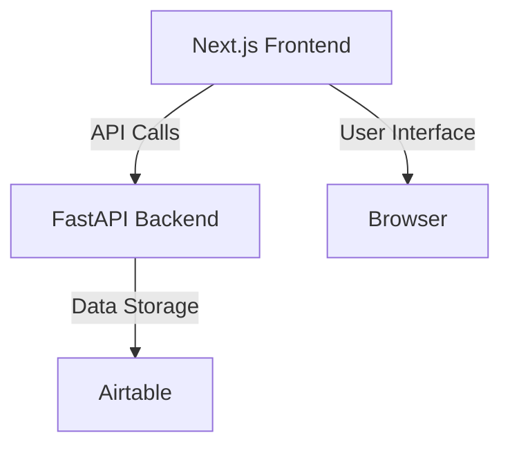

# System Patterns

## Architecture Overview
Suparank uses a client-server architecture with:
1. **Next.js Frontend**: React components with client-side state management
2. **FastAPI Backend**: Python-based API for sorting algorithm and Airtable integration
3. **Airtable Database**: External service for data persistence

## Core Components

### Frontend Components
- **Page (page.tsx)**: Main application container
- **ComparisonSection**: UI for presenting item pairs and capturing choices
- **RankingsList**: Displays ranked items after sorting completion
- **AddItemForm**: Interface for adding new items to the pool
- **API (api.ts)**: Client-side interface to backend services

### Backend Components
- **FastAPI App (index.py)**: Main API application
- **Merge Sort Implementation**: Interactive implementation of merge sort algorithm
- **Airtable Integration**: Connection to Airtable using pyairtable

## Key Design Patterns

### Data Flow Pattern
1. User adds items via frontend form
2. Items are stored in Airtable
3. When ranking begins, frontend requests a new session
4. Backend initializes merge sort state and returns session ID
5. Frontend requests pairs, backend provides based on current state
6. User selections are sent to backend to update sort state
7. Process repeats until sort is complete
8. Final ranked list is returned to frontend

### State Management
- **Session State**: Backend maintains sorting session state in Airtable
- **Client State**: Frontend uses React state hooks to manage UI state
- **Merge Sort State**: Backend tracks:
  - Current work list of sublists
  - Current merge task with left/right arrays and indices
  - Status (in_progress or completed)

### API Design Pattern
RESTful API with resource-based endpoints:
- `/api/items`: CRUD operations for items
- `/api/sort/start`: Initialize a sorting session
- `/api/sort/{session_id}/next`: Get next comparison pair
- `/api/sort/{session_id}/compare`: Submit comparison result
- `/api/sort/{session_id}/result`: Retrieve final sorted list

## Technical Decisions

### Interactive Merge Sort
Standard merge sort modified to:
- Pause at each comparison
- Store intermediate state
- Allow external input for comparison decisions
- Resume from stored state

### Airtable as Database
- Chose Airtable for rapid development and flexibility
- Tables for Items and Sessions
- JSON serialization for complex state storage

### Deployment Architecture
- Vercel for frontend hosting
- Python API deployed to Vercel serverless functions
- Environment variables for configuration management 